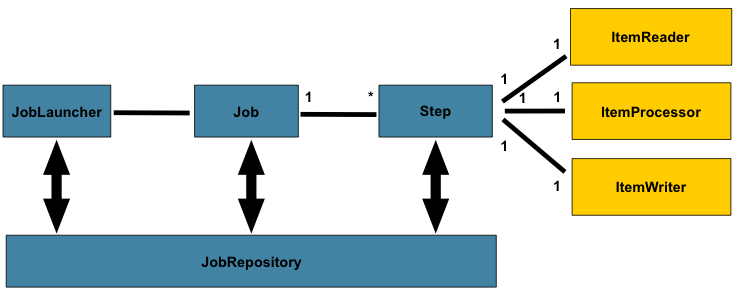

# Spring Batch 入门

## 第一节 Spring Batch概述

`Spring Batch`是一个轻量级的、完善的批处理框架，旨在帮助企业建立健壮、高效的批处理应用。
`Spring Batch`是Spring的一个子项目，使用Java语言并基于Spring框架为基础开发，使得已经使用Spring框架的开发者或者企业更容易访问和利用企业服务。

`Spring Batch`提供了大量可重用的组件，包括日志、追踪、事务、任务作业统计、任务重启、跳过、重复、资源管理。
对于大数据量和高性能的批处理任务，`Spring Batch`同样提供了高级功能和特性来支持，比如分区功能、远程功能。
总之，通过`Spring Batch`能够支持简单的、复杂的恶核大数据量的批处理作业。

`Spring Batch`是一个批处理应用框架，不是调度框架，但需要和调度框架合作来构建完成的批处理任务。它只关注批处理任务相关的问题，如事务、并发、监控、执行等，并不提供相应的调度功能。如果需要使用调度框架，在商业软件和开源软件中已经有很多优秀的企业级调度框架，如Quartz、Tivoli、Control-M、Cron等，都可以使用。

`Spring Batch`框架主要有以下功能：
+ Transaction Management 事务管理
+ Chunk based processing 基于块处理
+ Declarative I/O 声明式的输入输出
+ Start/Stop/Restart 启动/停止/重启
+ Retry/Skip 重试/跳过

`Spring Batch`框架主要有四个角色：
+ JobLauncher：任务启动器，用于启动任务，可以看做是程序入口
+ Job：代表着一个具体的任务
+ Step：代表着一个具体的步骤，一个Job可以包含多个Step
+ JobRepository：存储数据的地方，用于存储任务状态等信息

